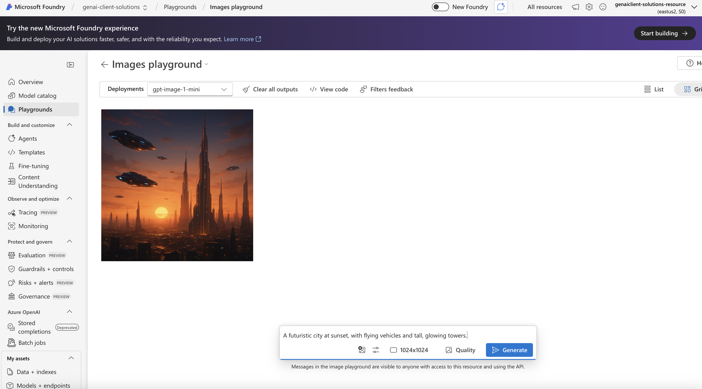
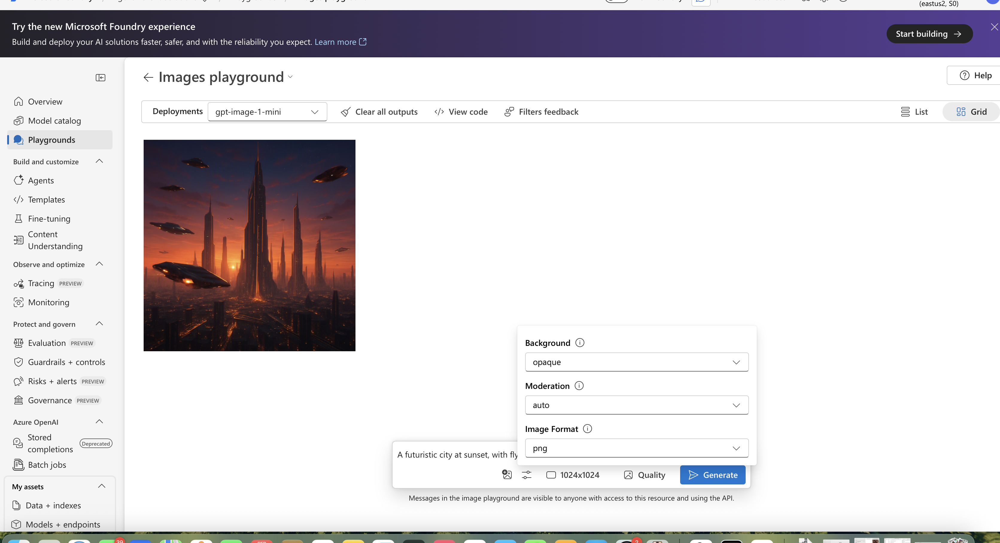
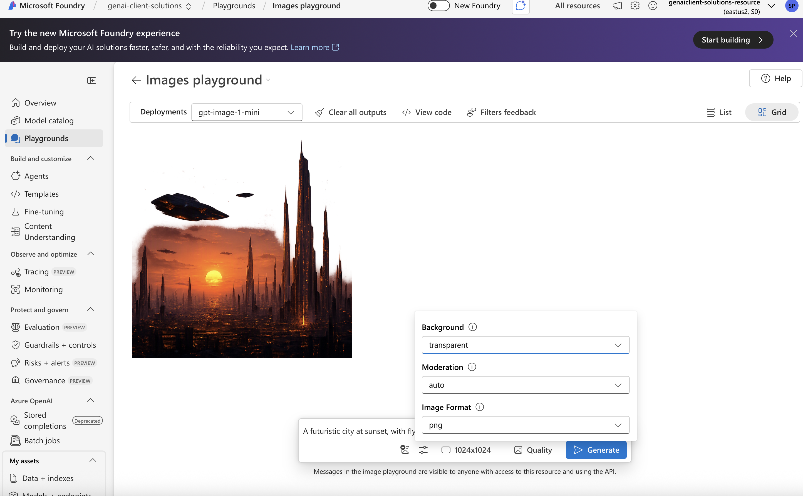
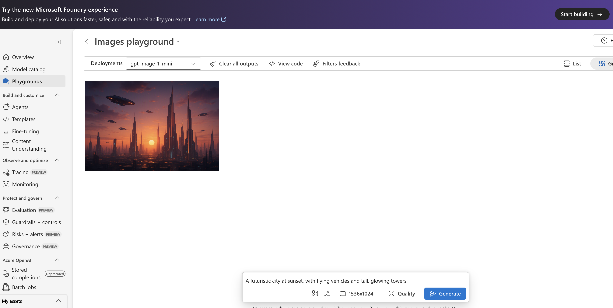
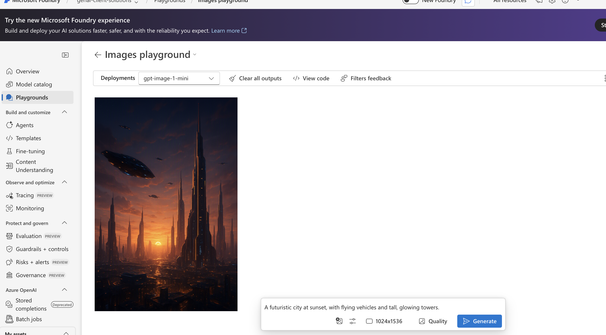
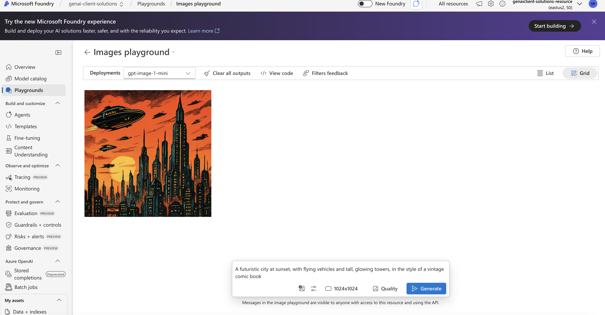

# 🎨 Generative AI Image Parameter Tuning

A hands-on experiment using **Microsoft Azure AI Foundry** to explore how image-generation parameters influence the output of a generative AI model.

## 🎯 Project Objective

The goal was to generate concept art for a fictional science-fiction game, **Cosmic Frontiers**, while investigating how different parameters affect the generated image.

**Model:** GPT-Image-1-Mini  
**Platform:** Azure AI Foundry  
**Skills:** Generative AI · Prompt Engineering · Parameter Tuning

### Base Prompt

> A futuristic city at sunset, with flying vehicles and tall, glowing towers.

---

## 🧪 Experiments

### 1. Baseline

Generated a reference image using the default configuration:

- Background: Auto
- Dimensions: 1024 × 1024

### 2. Background Parameter

I made sure  the prompt consistent while comparing **Opaque** and **Transparent** background settings.

| Opaque | Transparent ||---|---| |  |  |

This demonstrated how parameter changes can influence the generated output without rewriting the actual core prompt.

### 3. Image Dimensions

I compared landscape and portrait formats to observe how aspect ratio affects image composition.

**Landscape — 1536 × 1024**  **Portrait — 1024 × 1536**

The wider format provided more horizontal space for the cityscape, while the portrait format changed the vertical arrangement of the scene.

---

## 🚀 Final Experiment

I modified the prompt to request the futuristic city in the style of a vintage comic book.

This demonstrated how prompt engineering and parameter selection can be combined to control the visual direction of generated content.

---

## 💡 Key Learnings

- Model parameters can significantly influence generated outputs.
- Aspect ratio affects both image format and composition.
- Keeping the prompt consistent helps isolate the effect of individual parameters.
- Similar configurations can still produce variations between generations.
- Parameter selection should depend on the intended use case.

## 📄 Full Report

For detailed methodology, observations and results:

[[View the Experiment Report](Generative-AI-Parameter-Tuning-Report.pdf)](https://github.com/SudheshnaParimi/azure-ai-image-parameter-tuning/blob/main/Generative-AI-Parameter_Tuning_Report.docx)

---

**Tools:** Azure AI Foundry · GPT-Image-1-Mini · Generative AI · Prompt Engineering
